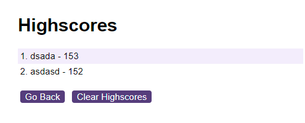

# Coding Quiz Challenge

## Description

This Coding Quiz Challenge is a web-based application that tests users on their knowledge of web development (HTML, CSS, and JavaScript). The quiz is timed, and for every incorrect answer, time is deducted from the timer.

## Features

- Timed multiple-choice questions.
- Questions cover HTML, CSS, and JavaScript.
- Score deduction for incorrect answers.
- High score tracking with user initials.

## How to Use

1. **Starting the Quiz:**
   - Open the `index.html` file in a web browser.
   - Click on the "Start Quiz" button to begin.
2. **During the Quiz:**
   - Choose your answers to the multiple-choice questions.
   - The timer at the top shows the remaining time.
   - Time is deducted for incorrect answers.
3. **End of the Quiz:**
   - The quiz ends when all questions are answered or the timer reaches zero.
   - Enter your initials to save your score.
   - Click "Submit" to save your score to the high scores list.
4. **Viewing High Scores:**
   - Click "View Highscores" on the main page or after submitting your score.
   - High scores can be cleared using the "Clear Highscores" button.

## Technologies Used

- HTML
- CSS
- JavaScript

## Screenshots

